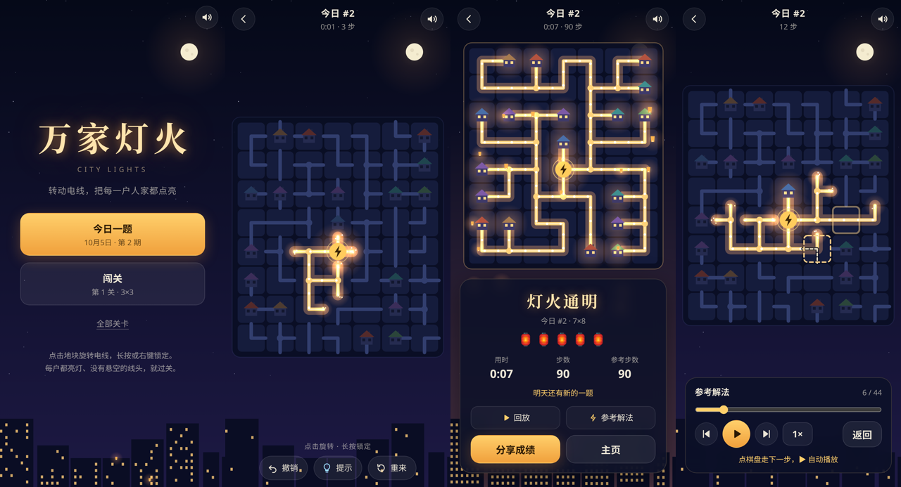

# 万家灯火 · City Lights

转动电线，把发电站的电送到每一户人家。接通的房子会亮起窗灯，全城接通时灯火从电站一路亮开，每户放起一盏孔明灯。

**在线试玩：<https://wowayou.github.io/city-lights/>**（手机、电脑都可以）



TypeScript + Canvas 2D + Web Audio，**零运行时依赖**，构建产物约 15 KB JS（gzip）。

## 怎么玩

| 操作 | 桌面 | 手机 |
|---|---|---|
| 旋转地块（顺时针 90°） | 左键点击；方向键选格后按空格 / 回车 | 轻点 |
| 锁定 / 解锁地块（锁定后点它不会转） | 右键、长按；键盘 L 或 X | 长按 |
| 撤销（一次提示整体撤回） | 底部「撤销」；Z 或 Backspace | 底部「撤销」 |
| 提示：把一格转到参考答案并锁定 | 底部「提示」；H | 底部「提示」 |
| 从头开始（点两次确认） | 底部「重来」 | 同左 |
| 静音 / 返回主页 | M / Esc，或右上角、左上角按钮 | 按钮 |
| 回放 / 参考解法：下一步、上一步、自动播放、拖动进度、1×/2×/4× | 点棋盘或 → / 回车走一步，← 退一步，空格自动播放，Esc 返回 | 点棋盘走一步；播放面板 |

**过关条件**：每一格都和电站连通，并且没有任何悬空的线头。通了电却悬空的线头会冒火花，这就是还没接好的地方。

- **今日一题**：每天一道 7×8，所有人同一题（种子是本地日期），完成后可以分享成绩（灯笼评级、用时、步数，不剧透盘面），记录连续天数。
- **闯关**：从 3×3 开始逐级变大，最大 9×10；同一关对所有人都是同一道题。主页「全部关卡」可以重玩任意已过的关，每关保留最好成绩。
- **回放与参考解法**：过关后可以回放自己的解法（自动播放，保留真实节奏，超过 0.9 秒的停顿会压缩），也可以看参考解法：从同一个开局出发，由近及远逐格转到参考答案。参考解法打开后停在第 0 步，**点一下棋盘走一步**；下一步要转的格子用虚线框标出，框里的虚线是它转好后的形状。也可以按 ▶ 自动播放（每格之间 0.9 秒）。今日一题过后重新打开，回放仍然在。

进行中的局面会自动保存（刷新、切走都不丢），换设备不同步。

## 设计取舍

| 决定 | 原因 |
|---|---|
| **玩法是 Net 式旋转接线**（经典的 Net / Infinity Loop 一类） | 规则一句话说清，单指操作，手机友好；游戏大厅里还没有解谜类。 |
| **题目 = 网格上的随机生成树**，房子就是树的叶子 | 生成即可保证有解，不需要求解器；房子的数量和分布自然随机。 |
| **不要求唯一解**：任何"全通电 + 无线头"的摆法都算赢 | 判定只看物理状态。旋转不改变每格的接口数，接口总数恒为 2(n−1)，所以"全连通且无悬空"必然就是一棵生成树。 |
| **不生成十字路口** | 十字转到哪个方向都一样，是一格没有决策的白板。 |
| **"参考步数"不叫"最少步数"** | 它是回到生成答案所需的点击数；存在其他解时可能有更短的走法，不能声称最优。灯笼评级按 步数 / 参考步数 给 1–5 盏。 |
| **长按锁定** | 大盘面的标准技巧是先确定边角再推进，锁定避免误触把已确认的格子转走。 |
| **撤销会退回步数；「重来」清空操作记录、步数归零，但计时继续** | 步数统计的是这条解法用了多少下，所以撤销掉的操作不算；用时照常累计，代表实际花的工夫。回放播放的就是最终这条解法。 |
| **提示 = 把一格转到参考答案并锁定**，每次少一盏灯笼（最少 1 盏），第一次使用要再点一次确认 | 卡关时（尤其闯关会被卡死）要有出路，但不能白给。优先修正"锁在错误位置"的格子（那是在误导你），其余按离电站由近及远给。提示锁的格子用青色图钉标出；撤销能撤回提示的效果，但已用掉的次数不退。分享文本会带上 💡 次数。 |
| **参考解法只在过关后开放** | 卡住时用提示一格一格推进即可；过关前直接看整盘答案会让每日一题失去意义。 |
| **回放的"一步" = 一格**（这一格的所有转动），参考解法默认逐步、自己的回放默认自动播放 | 和提示同一个粒度、同一个顺序：从开局连续按提示，经过的格子顺序与逐步演示完全一致（有测试），所以"演示一步 = 一次提示"。两者不重复：提示作用在你进行中的盘面上、扣灯笼、只在对局中可用；逐步演示是过关后在开局副本上复盘，不影响成绩。参考解法是用来学的，所以让人按自己的节奏点；自己的回放是用来看的，所以直接播。 |
| **操作记录 = 回放**：存的是"第几格、转还是锁、是否提示、相对时间"，进行中的存档也存这份记录 | 同一份数据同时用于撤销、断点续玩和回放，从开局逐条重放必然得到同一盘面（有测试）。每条约 2 个整数，今日一题保留最近 30 天的回放记录。 |
| **计时从第一次旋转开始**，切到后台不计时 | 打开题目先观察不该被罚。 |
| **天际线的亮灯比例跟着进度走** | 画面本身就在反馈"已经点亮了多少户"，过关时整片天际线全亮。 |
| 音效：每多点亮一户响一声五声音阶的铃，音高随户数上升 | 越接近完成越"往上走"，不看 HUD 也能听出进展。 |
| 中英双语 | 按浏览器语言自动选择。 |

## 运行

```bash
npm install
npm run dev        # http://localhost:5173 ，同一 Wi‑Fi 下手机可用局域网 IP 打开
npm test           # 单元测试
npm run build      # 类型检查 + 生产构建到 dist/（纯静态）
```

推送到 `main` 后，GitHub Actions（[`.github/workflows/deploy.yml`](.github/workflows/deploy.yml)）依次做类型检查、单元测试、构建，全部通过才发布到 GitHub Pages。

## 验证

- **`npm test`**（Vitest，34 项）：旋转与方向运算；生成器在 4 种尺寸 × 40 个种子上都产出无十字的生成树且解开即判赢；同种子同题；按参考步数点击恰好解开；悬空线头与锁定；60 天的每日题和 60 个关卡开局都不是已解状态；期号跨月跨年、本地日期、连续天数；灯笼评级（含提示扣灯笼）；存储被禁用或数据损坏时回退默认值、存档尺寸不符时丢弃、首版存档（只有盘面没有记录）升级为回放起点、每关只保留更好的成绩、旧的每日回放记录被清理；撤销（锁、转、整次提示）、重来；提示优先修正锁错的格、提示到底一定能解开；参考解法的点击数恰好等于参考步数并能解开；随机乱玩（转、锁、撤销、提示混合）后编码→解码→重放得到逐位相同的盘面；坏记录被拒绝；回放计时、变速（4× 播 3 秒 = 1× 播 12 秒）、拖动与播放一致；一步 = 一格，从开局连续提示的顺序等于逐步演示的顺序；下一步只播一格就停、预览形状正确、上一步能退回半播完的一步；参考解法自动播放的节奏不快于每格 0.9 秒。
- **`node tools/shots.mjs <输出目录>`**（先 `npm run build`；`SHOT_LANG=zh-CN` 切中文；`BASE=https://wowayou.github.io/city-lights/` 改为检查线上站点）：用本机 Chromium 通过 CDP 驱动生产构建，手机（390×844）和桌面（1280×800）各跑一遍，按钮也用真实鼠标点击：旋转、长按锁定且不计步、锁定格不响应点击、撤销先撤锁再撤转、提示需二次确认且一次撤销撤回整次提示、两次提示后结算少两盏灯笼并注明；回放从开局开始、变速到 4×、播完停在已解状态、拖动进度条按步回退盘面、返回结算卡；参考解法打开时停在第 0 步并有预览和操作提示、真实点击棋盘一次只走一格、「下一步」「上一步」按钮、自动播放后提示消失、转动总数等于参考步数且播完即解开；今日一题上连点 6 下恰好走 6 格；选关页列出已过关卡（带灯笼）和当前关、已过关卡可重玩；今日一题主页显示"继续"、刷新后进度保留、**按参考解逐格真实点击解完**、重新打开仍是已解状态且能回放；首版格式的存档能续玩、能完成、回放从存档位置开始；全程无控制台错误；同时输出各阶段截图。

## 结构

```
src/
  game/      纯逻辑，无 DOM：grid(方向位运算) rng(种子随机) generate(生成树+打乱) board(旋转/锁定/撤销/提示/操作记录/通电 BFS/判赢)
             replay(参考解法、记录编解码、按时间步进的回放) modes(每日/关卡/评级)
  render/    renderer：夜空、天际线、电线与电流光点、火花、房子、电站、孔明灯
  audio/     Web Audio 合成音效
  ui/        中英文案
  storage.ts localStorage，读写全部容错
  main.ts    界面（主页/选关/对局/结算/回放）、输入、主循环
tools/shots.mjs  无头浏览器端到端检查 + 截图
```

## 已知限制

- 闯关的回放只在刚过关的结算卡上可看；选关页重玩是重新开局（只有今日一题会长期保存回放记录）。
- 难度只靠盘面大小调节，没有用求解器衡量"需要几步推理"；同尺寸的题目难度会有起伏。
- 没有 Service Worker，首次加载后断网不保证可玩。
- 每日题按设备本地日期切换，不同时区的玩家会在各自的午夜换题。
- iOS 静音拨片打开时 Web Audio 不发声（系统行为）；震动反馈只在支持 `navigator.vibrate` 的安卓浏览器上有。
